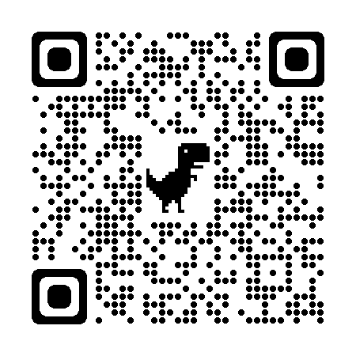

## GROUP LAP01
Story by AI that was recycled: [The Hellmut in the Coffee Shop](https://storiesby.ai/p/the-hellmouth-in-the-coffee-shop)  

Credits of 3d models:  
* Winter Cabin: https://skfb.ly/oOTYC
* Demon: https://skfb.ly/6RSW6 
* Girl: https://skfb.ly/6zGMG

[Click here to enter the virtual world from Desktop](https://laverbenaelectronica.github.io/vr/hackaton/FINAL/LAP01/index.html)   
Scan this QR to enter the virtual world from a Smartphone.   

## GROUP LAP02
Story by AI that was recycled: [Max, The Plant Whisperer](https://storiesby.ai/p/max-the-plant-whisperer)

[Click here to enter the virtual world from Desktop](https://laverbenaelectronica.github.io/vr/hackaton/FINAL/LAP02/index.html)   

## GROUP LAP03
Story by AI that was recycled: [The Greatest Goddam Hero I've Ever Known](https://storiesby.ai/p/the-greatest-goddamn-hero-ive-ever)  

[Click here to enter the virtual world from Desktop](https://laverbenaelectronica.github.io/vr/hackaton/FINAL/LAP03/index.html)   

## GROUP LAP05
Story by AI that was recycled: [The Gift of a Bird's Song](https://storiesby.ai/p/the-gift-of-a-birds-song)

[Click here to enter the virtual world from Desktop](https://laverbenaelectronica.github.io/vr/hackaton/FINAL/LAP05/index.html)   

## GROUP LAP06
Story by AI that was recycled: [The Underground World Of Plant Collecting](https://storiesby.ai/p/the-underground-world-of-plant-collecting)

[Click here to enter the virtual world from Desktop](https://laverbenaelectronica.github.io/vr/hackaton/FINAL/LAP06/index.html)   

## GROUP LAP09
Story by AI that was recycled: [When The Sky Turned Red](https://storiesby.ai/p/when-the-sky-turned-red)

[Click here to enter the virtual world from Desktop](https://laverbenaelectronica.github.io/vr/hackaton/FINAL/LAP09/index.html)   
